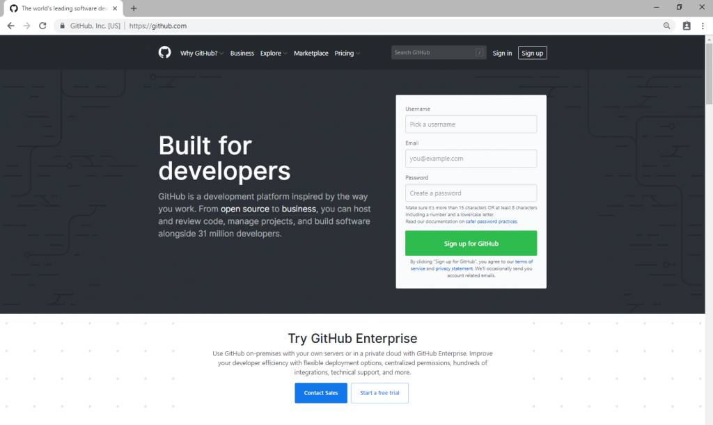
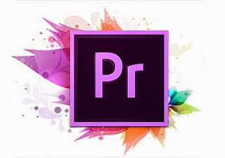

<h1>Latihan 2 dan Tugas</h1>

<h2>GITHUB<h3>

Apa Itu Git? 
Git merupakan sistem pengontrol versi yang dikembangkan oleh Linus Torvalds (yang juga menciptakan dan mengembangkan Linux).

Apa Itu Hub? 
Jika Git adalah jantung, maka Hub adalah jiwa GitHub. Sistem Hub yang ada pada GitHub berfungsi untuk mengubah baris perintah (command line), seperti Git, menjadi jaringan media sosial terbesar bagi para developer.

Selain berkontribusi dalam proyek tertentu, GitHub juga memungkinkan usernya untuk berkomunikasi dengan orang-orang yang memiliki kesamaan visi dan misi. Anda bahkan bisa follow mereka dan melihat proyek yang dilakukan atau bahkan mencari tahu siapa saja yang terhubung dengan mereka.

Repositori 
Repositori atau repo adalah direktori penyimpanan file proyek. Di sini, Anda bisa menyimpan apa pun yang berkaitan dengan proyek yang sedang dibuat, misalnya file kode, gambar, atau audio. Repo sendiri bertempat di penyimpanan atau storage GitHub atau repositori lokal di komputer Anda.

Branch 
Brach merupakan salinan dari repositori milik Anda. Branch digunakan ketika Anda hendak melakukan suatu pengembangan atau development secara terpisah.

Pekerjaan atau task yang dilakukan di branch tidak akan memengaruhi repositori pusat atau branch lainnya. Jika pengembangannya sudah selesai, Anda bisa menggabungkan branch saat ini ke branch lainnya dah juga repositori pusat dengan menggunakan pull request.

Pull Request 
Pull request adalah ketika Anda menginformasikan user bahwa Anda sudah push perubahan yang dilakukan di branch ke master repositori. Collaborator repositori akan menerima atau menolak pull request. Segera setelah pull request diterima, Anda bisa mendiskusikan dan mengulas proyek bersama dengan collaborator.

Forking Repositori 
Forking repositori artinya Anda membuat proyek baru berdasarkan repositori yang sudah ada. Dalam kalimat yang lebih sederhana, forking repo berarti Anda menyalin repositori yang sudah ada, kemudian membuat beberapa perubahan yang diperlukan, lalu menyimpan versi terbarunya sebagai repositori baru, dan menjadikannya proyek Anda sendiri.

<h2>GMAIL<h3>

Apa Itu Gmail?

Gmail adalah kependekan dari Google Mail. Gmail/Goggle Mail adalah layanan email berbasis web yang disediakan oleh Google secara gratis. Layanan ini diluncurkan pada tanggal 21 Maret 2004 dan sempat membuat heboh banyak kalangan karena langsung menyediakan kapasitas email sebesar 1 GB yang pada saat itu sangat tidak wajar.

<h1>noncloud<h3>

Adobe Premiere adalah salah satu program editing video yang dikembangan oleh Adobe Systems. Adobe Systems sendiri adalah perusahaan perangkat lunak yang bergerak di bidang grafis, animasi, video, dan pengembangan web. Adobe adalah salah satu perusahaan perangkat lunak yg paling besar di dunia. Adobe premiere merupakan sebuah program editing video yang sering sekali digunakan oleh rumah-rumah produksi, televisi dan praktisi di bidangnya. 

Dalam hal editing, adobe banyak sekali memproduksi software-software canggih yang mungkin seringkali kita gunakan. Seperti Adobe Photoshop, 3D Studio Maker, Adobe After Effects, Adobe Ilutrator dan masih banyak software edting lainnya. Adobe premiere sendiri lebih dikhususkan untuk merangkai gambar, video dan audio. Sedangkan untuk menambahkan animasi pada video yang kita kerjakan, bisa menggunakan Adobe After Effects. Produk-produk dari Adobe Systems dibuat sengaja untuk bisa saling berintegrasi, hal ini bertujuan memudahkan pemisahan fungsi aplikasi bagi para pengguna.

<h2>Fitur<h3>

Premiere Pro mendukung editing video berkualitas tinggi di hingga 4K x 4K resolusi, di hingga 32-bit per channel warna, baik dalam dan RGB YUV.  Versi 1,5 ditingkatkan dukungan untuk video definisi tinggi konten, dan manajemen proyek baru ditambahkan alat dan filter baru. Hal ini juga termasuk dukungan untuk 24p panjangnya. Versi 1.5.1 menambahkan dukungan untuk HDV. Versi 2.0 lebih refines 24p dan HDV editing, dan merupakan yang pertama NLE utama untuk mendukung natively Canon 24F format pada kamera seperti Canon XL H1, dengan tambahan update. Sejak versi 2.0, Premiere Pro telah memerlukan prosesor yang mendukung SSE2, yang tidak tersedia di beberapa prosesor tua.

Pada Premiere Pro CS3 ditambahkan dukungan untuk output ke Blu-ray Disc, dan Flash MPEG-4/H.264 berbasis situs web, serta Waktu Remapping, yang mudah-di-gunakan variabel Fram rate pelaksanaan. Dimulai di Premiere Pro CS3, Adobe Encore disertakan untuk authoring menu dan interaktivitas untuk DVD, Blu-ray discs, dan Flash untuk proyek web. Adobe OnLocation (sekarang lintas platform pada CS4) juga termasuk untuk direct-to-disc rekaman dan monitoring. Perbaruan untuk Premiere Pro CS3 asli telah menambahkan dukungan untuk kamera format file baru. 3,1 ditambahkan asli Panasonic P2 MXF impor, mengedit, dan ekspor DVCPRO, DVCPRO HD DVCPRO50 dan material. 3,2 ditambahkan asli XDCAM HD EX dan impor dan mengedit.