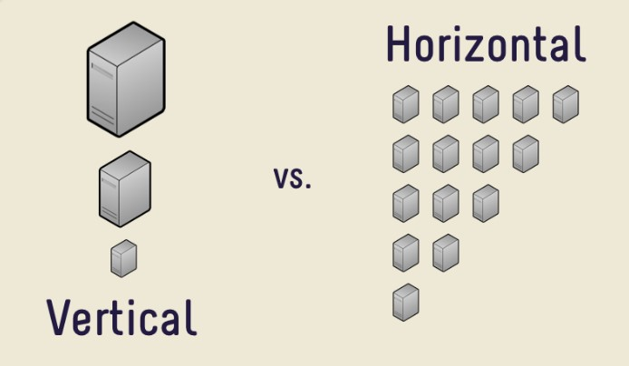
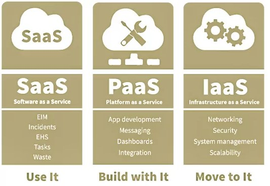
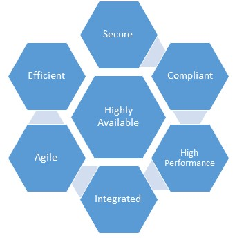
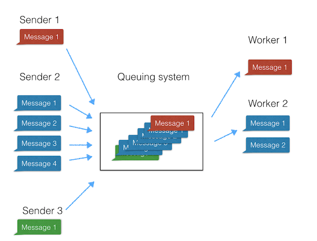

<h1>Saas(Software as a Service)</h1>
<h3>Pengertian Saas(Software as a Service)<h3>
SaaS (software as a service atau perangkat lunak berbentuk layanan) adalah suatu model penyampaian aplikasi perangkat lunak oleh suatu vendor perangkat lunak yang mengembangkan aplikasi web yang diinangi dan dioperasikan (baik secara mandiri maupun melalui pihak ketiga) untuk digunakan oleh pelanggannya melalui Internet.
Pelanggan tidak mengeluarkan uang untuk memiliki perangkat lunak tersebut melainkan hanya untuk menggunakan. Pelanggan menggunakan perangkat lunak tersebut melalui antarmuka pemrograman aplikasi yang dapat diakses melalui web dan seringkali ditulis menggunakan layanan web atau REST

<h3>Arsitektur SaaS<h3>

 

Dengan model ini, satu versi aplikasi, dengan satu konfigurasi digunakan untuk semua pelanggan. Aplikasi ini diinstal pada banyak mesin untuk mendukung skalabilitas (disebut penskalaan horizontal). Dalam beberapa kasus, versi kedua aplikasi diatur untuk menawarkan kelompok pelanggan tertentu dengan akses ke versi pra-rilis aplikasi untuk tujuan pengujian. Dalam model tradisional ini, setiap versi aplikasi didasarkan pada kode unik. Meskipun pengecualian, beberapa solusi SaaS tidak menggunakan multitenancy, untuk mengelola secara efektif sejumlah besar pelanggan di tempat. Apakah multitenancy merupakan komponen yang diperlukan untuk perangkat lunak-sebagai-layanan adalah topik kontroversi.

Ada dua varietas utama SaaS:

1. SaaS Vertikal 
Perangkat Lunak yang menjawab kebutuhan industri tertentu (Perangkat lunak untuk kesehatan, pertanian, real estat, industri keuangan)
2. SaaS Horisontal 
Produk-produk yang berfokus pada kategori perangkat lunak (pemasaran, penjualan, alat pengembang, SDM) tetapi agnostik industri.

 

<h3>Mengapa Menggunakan Arsitektur SaaS?<h3>

 

Seperti yang disebutkan dalam pendahuluan, perangkat lunak telah didistribusikan kepada pelanggan dalam berbagai saluran selama beberapa dekade terakhir. Saluran distribusi yang lebih baru dalam Perangkat Lunak sebagai Layanan (atau SaaS).

<h3>Konsumen<h3>

Dari perspektif konsumen, produk SaaS adalah salah satu cara termudah untuk menggunakan layanan atau produk digital. Anda cukup mengaksesnya melalui web, membayar layanan dan menggunakannya! Dalam beberapa tahun terakhir kami telah melihat kemunculan ribuan produk SaaS yang ditargetkan untuk konsumen seperti:
1. Twitter
2. Netfilx
3. Amazon Prime
4. Facebook
5. Google Docs
6. dll

<h3>Simplicity<h3>

Aplikasi perangkat lunak yang dirancang sebagai solusi SaaS biasanya diakses melalui web melalui berbagai jenis perangkat. Kemajuan dalam bahasa pemrograman sisi klien seperti JavaScript telah menghasilkan antarmuka web yang lebih intuitif dan karenanya, membuat penggunaan aplikasi yang dikirim melalui internet mudah digunakan seperti rekan-rekan desktop mereka.

<h3>Economical<h3>

Model pembayaran biaya subskrip bulanan atau tahunan memudahkan bisnis untuk menganggarkan dana, ditambah dengan ini tanpa biaya pemasangan infrastruktur, mudah untuk melihat bagaimana memilih menggunakan solusi SaaS dapat menghemat uang bisnis.

<h3>Security<h3>

Keamanan adalah aspek penting dari solusi pengembangan perangkat lunak dan platform SaaS tidak berbeda. Sebagai konsumen aplikasi yang dirancang menggunakan SaaS, Anda tidak perlu khawatir dengan bagaimana data Anda dikunci.

<h3>Compatibility<h3>

Dengan penginstalan perangkat lunak tradisional, pembaruan dan tambalan terkadang membutuhkan banyak waktu dan uang. Ini terutama benar dalam perusahaan. Selain itu, perbedaan versi antara anggota tim dari tenaga kerja Anda dapat menyebabkan masalah kompatibilitas dan bahkan lebih banyak waktu terbuang. Namun, dengan SaaS, pelanggan dapat log-on ke layanan yang sudah ditingkatkan.

 

Platform SaaS memiliki beragam kemampuan. Terutama ketika digabungkan dengan penawaran cloud lainnya seperti IaaS (Infrastructure as a Service) dan PaaS (Platform as a Service). 
Teknologi cloud seperti Microsoft Azure memungkinkan Anda menyediakan server yang dapat meng-host situs web, database, dan banyak lagi. Infrastruktur yang secara historis akan secara fisik dipasang di lokasi bisnis dan dijalankan oleh tim TI internal, sekarang dapat disediakan dari dasbor online hanya dengan beberapa klik mouse. 

Solusi SaaS dapat digunakan untuk lingkungan ini dan, secara teori, menawarkan semua jenis layanan yang dapat dikembangkan sebagai aplikasi perangkat lunak yang dapat mencakup, tetapi tidak terbatas pada:

1. Office Aplications
2. Email and instant messaging
3. Social media
4. Security and Authentication
5. Machine Learning
6. Artificial intelligence
7. Location Services
8. Data streaming and lookup services

<h3>Komponen Kunci dari Platform SaaS<h3>

 

Bagian penting dari pengembangan produk SaaS terbaru Anda adalah menentukan dengan komponen atau fitur utama yang diharapkan pengguna sebagai standar. Dapat dimengerti bahwa fitur akan didorong oleh permintaan pasar dan komunitas pengguna tetapi ada beberapa komponen utama yang diharapkan pengguna.

<h3>Scalability<h3>

Arsitektur SaaS dapat membuat skala dan menampung ratusan, jika tidak ribuan pengguna secara bersamaan mengaksesnya melalui web? Aplikasi SaaS yang dirancang dengan baik harus dapat melakukan ini.

Anda dapat mencapai ini dengan menggunakan perangkat keras seperti Network Load Balancers untuk mendistribusikan lalu lintas masuk secara merata di beberapa server web. Dari perspektif arsitektur perangkat lunak, Anda dapat memperkenalkan pemisahan kekhawatiran dengan memiliki lapisan individual untuk menangani akses data, logika bisnis, dan lapisan presentasi aplikasi Anda yang akan membantu skala aplikasi Anda lebih mudah.

<h2>Cara membangun aplikasi SaaS berbasis cloud</h2>

Saat membangun aplikasi SaaS (global), ada kemungkinan besar bahwa Anda membangunnya di cloud. Cloud memiliki banyak keunggulan - pikirkan skalabilitas - berbeda dengan lingkungan server lokal. 

Selain kemampuan dan keterampilan pribadi, pilihan bahasa pemrograman Anda akan dipengaruhi oleh kemungkinan masing-masing bahasa. Ada berbagai bahasa pemrograman (modern) di luar sana sehingga sulit untuk memilih yang benar.

Python adalah bahasa pemrograman yang banyak digunakan, dirancang untuk menekankan keterbacaan kode-nya.

Python dapat melakukan banyak hal. Apa pun aplikasi web yang ingin Anda bangun,kemungkinan ada kerangka kerja untuknya dengan Python.

<h3>Memilih Database<h3>

Jadi, salah satu hal pertama dalam daftar Anda akan mencakup pemasangan basis data. Kami merekomendasikan penggunaan basis data berorientasi dokumen. Database dokumen sangat berbeda dengan konsep tradisional database relasional.

Mengapa kami memilih MongoDB? Karena MongoDB adalah database berorientasi dokumen yang memberikan kinerja tinggi, ketersediaan tinggi, dan skalabilitas mudah. Ya. Selain kinerja (yang menginginkan database yang lambat?), Skalabilitas adalah faktor terpenting bagi kami sebagai bisnis SaaS global.

Banyak pendiri SaaS bertujuan untuk meningkatkan skala bisnis mereka. Selain mengubah skala produk Anda dari perspektif bisnis, Anda tidak boleh melupakan masalah teknis.

Menskalakan teknologi Anda dengan MongoDB cukup mudah (ok, setidaknya lebih mudah dibandingkan dengan database lain). Dengan sharding otomatis, Anda dapat mendistribusikan data di berbagai mesin.

<h3>Queuing system<h3>
Sistem antrian pesan adalah protokol komunikasi yang tidak sinkron, memungkinkan pengirim dan penerima pesan tidak berinteraksi pada saat yang bersamaan. Message Queuing (MSMQ) memungkinkan aplikasi web untuk berjalan pada waktu yang berbeda dan untuk berkomunikasi dengan berbagai integrasi pihak ketiga / API / dan layanan lainnya secara tidak sinkron.

 

