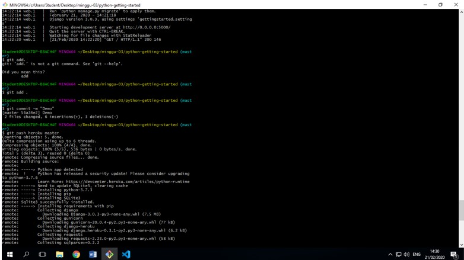
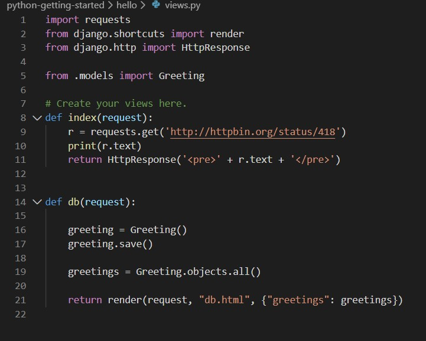

<h1>PRAKTIKUM MINGGU 3</h1>

Sebelum praktikum minggu ke 3 dimulai mahasiswa membuat akun pada Heroku menggunakan email yang digunakan mahasiswa lalu mengkonfirmasi lewat email yang di guanakan. 

setelah melakukan logged in selanjutnya ialah melakukan clone pada heroku. tujuan ini merupakan untuk pengenalan penggunaan heroku.

pada gambar diatas juga selajutnya melakukan pada git bash yang sudah di clone kemudian ketikan "heroku create" untuk membuat aplikasi pada akun heroku yang sudah dibuat sebelumnya.
selanjunya melakukan deploy  terhadap aplikasi kita yang sudah dibuat sebelumnya dengan menggunakan perintah "git add .", diikuti dengan menggunakan "git commit -m" sebagai penjelasannya dan selanjutnya push ke heroku dengan sintaks "git push heroku master"

praktik selanjutnya ialah dengan menambah dan memodifikasi pada file views.py. yang pada file tersebut menambahkan module requests dan import requests.

setelah itu buka aplikasi kita yang sudah dibuat dan dimodifikasi sebelumnya pada localhost dan hasilnya seperti gambar berikut.

<h2>Kesimpulan Pada praktiku ini adalah:<h2>

1. mahasiswa menjadi tahu apa itu heroku serta cara menggunakannya.
2. bisa membuat aplikasi web mengunakan heroku
3. mengetahui apa saja perintah-perintah apa saja yang perlu untuk menggunakan heroku.
