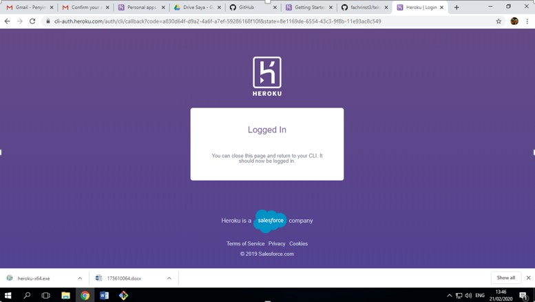
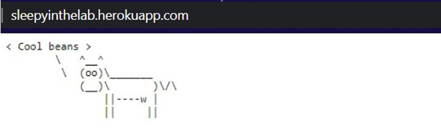

<h1>Deployment ke PaaS diHeroku untuk PHP</h1>

 langkah pertama iyalah mengkloning aplikasi dari heroku, lalu login heroku dengan sintaks pada git bash "heroku login" untuk masuk ke heroku CLI 
 
 
 perlu diingat untuk masuk ke heroku CLI sebelumnya harus mengistal php -v(php version), CLI heroku, serta composer.

 setelah itu ketikan "heroku create" secara otomatis akan membuat repo di akun heroku kita serta remote untuk mengelolanya di local bash. dibash local kita bisa mengelola serta bisa mengubah nama aplikasi kita sendiri.

 selanjutnya adalah dengan mengubah atau memodifikasi terhadap file index. selanjutnya deploy ke heroku dan tampilkan
 

