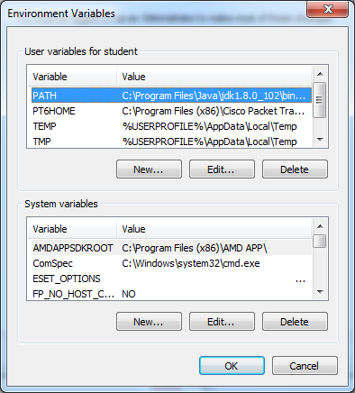
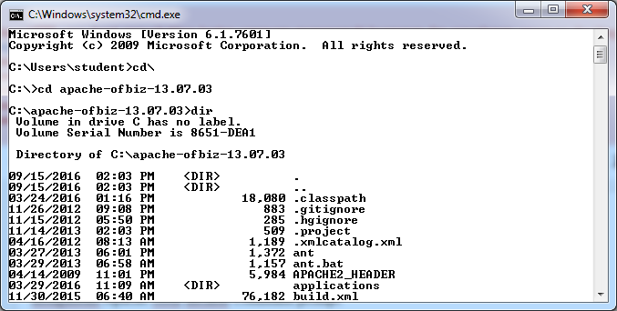
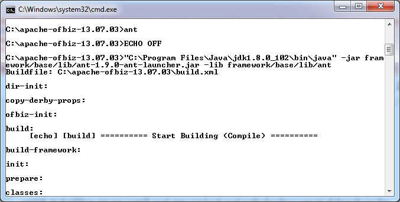
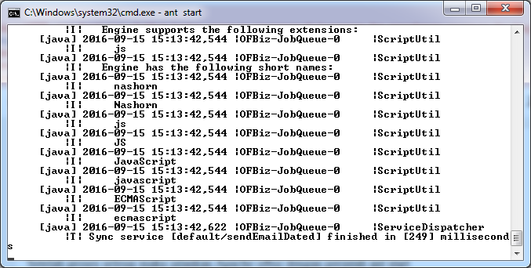

<h1>Praktikum Teknologi Cloud Computing - Minggu 5</h1>

instalasi apache OFBiz

Buka cmd cari folder apache ofbiz yang sudah diekstrak tadi seperti gambar dibawah ini 

kemudian install gradle atau apache ant untuk mengkompilasi source code menjadi executable

setelah proses penginstalan selesai selanjutnya maka jalankan Apache ofbiz dengan perintah ant start

