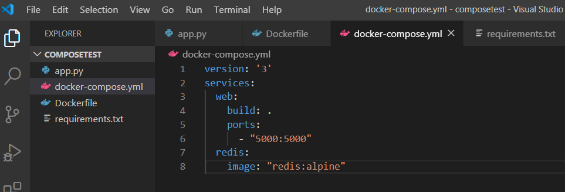

<h1>Latihan Pertemuan Ke 8</h1>
Pada pertemuan ke 8 ini adalah membahas tentang Docker compose. berikut adalah cara untuk melakukan docker compose

1. pertama iyalah membuat folder dengan nama composetest 

2. langkah selanjutnya adalah membuat file app.py 

3. membuat file requirements.txt

4. langkah selanjutnya ialah membuat Dockerfile

5. define services compose file

6. run dengan perintah docker-compose up

7. lihat hasil outputnya di web browser

refresh pada web browser untuk melihat berubah pada angka

8. Edit the Compose file to add a bind mount

9. Perintah lain docker-compose

Menjalankan dan melihat variabel yang tersedia
$ docker-compose run web env

Menghentikan aplikasi
$ docker-compose stop

Menghapus containers
$ docker-compose down --volumes