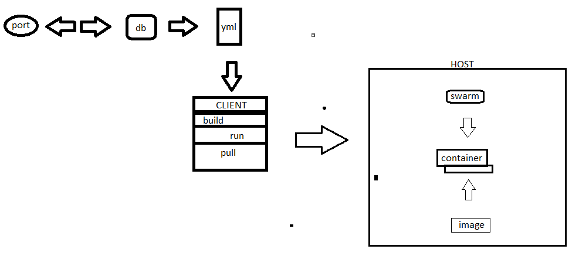

diagram tersebut adalah penjelasan bagaimana keterkaitan yang ada pada docker yang dimana docker client terdiri dari manajement perintah build, run, dan pull terhadap docker host yang terdiri dari container dan image. kalau menggunakan docker compose akan terjadi perubahan atau penambahan file.