<h1> Praktikum TCC minggu 09 (Docker for beginners-Linux)</h1>

untuk praktikum ini sebelum mulai untuk menggunakan terminal linux pada web maka terlebih dahulu untuk Login ke akun Docker masing-masing

<h2>#0 Prerequisites</h2>
clone repo dari github dengan nama linux_tweet_app pada akun dockersamples.

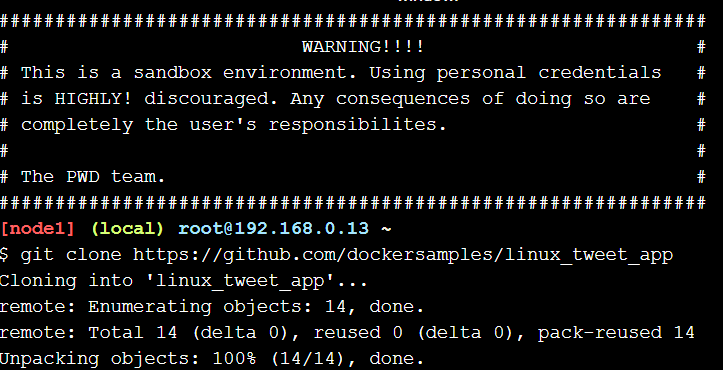

<h2>#1 Run some simple docker container</h2>

1. memulai dengan container image alpine

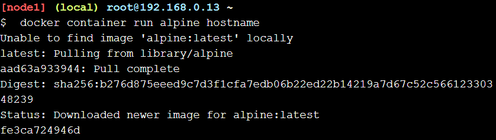

2. melihat semua daftar container

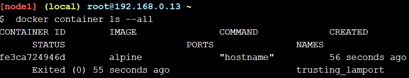

3. Menjalankan Docker container dan mengakses terminal ubuntu

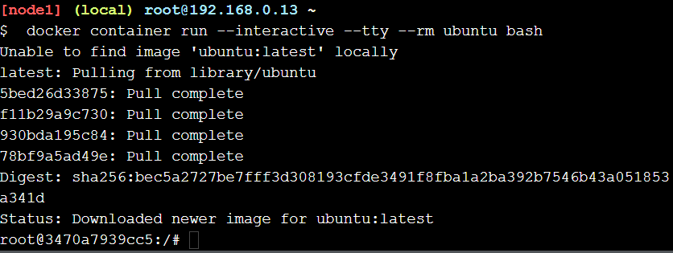

4. perintah seperti:

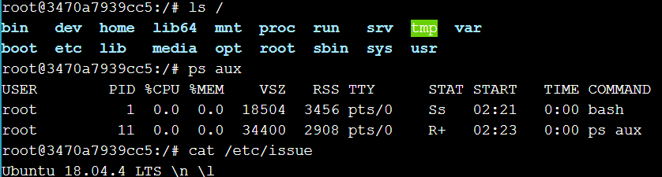
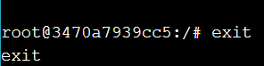

5. Cek versi host VM

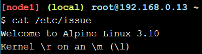

6. menjalankan MySQL container

7. melihat daftar container

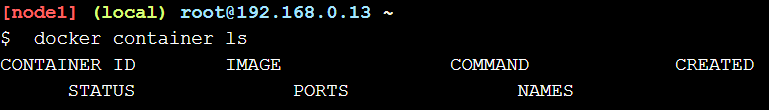

8. Cek log dan proses yang berjalan didalam container

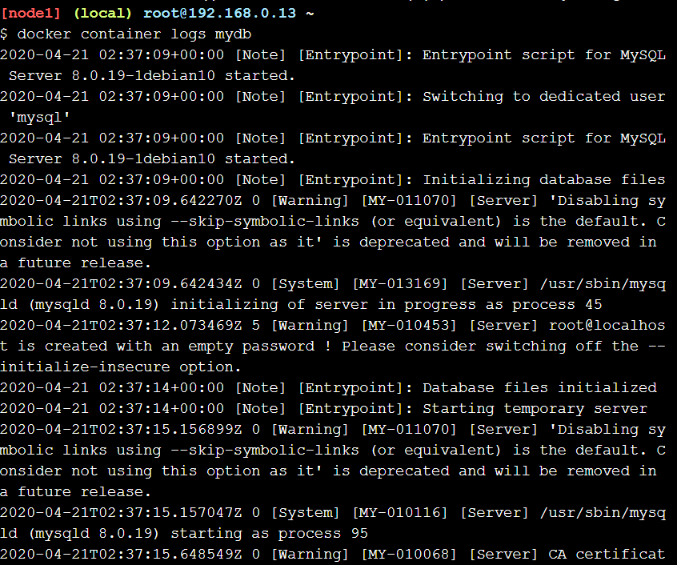
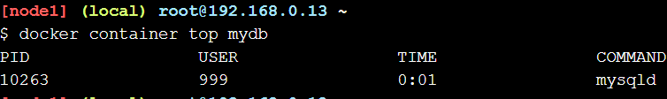

9. melihat versi MySQL yang digunakan

10. menghubungkan terminal ke sh

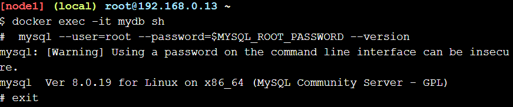

<h2>#2 package and run a custom app using docker</h2>
Membuat image sederhana

1. berpindah ke direktory repo yang telah diclone dan melihat isi dari Dockerfile

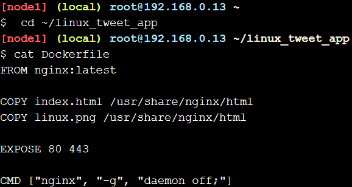

2. mengexport variabel dengan akun docker masing-masing

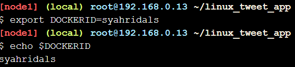

3. membuat docker image

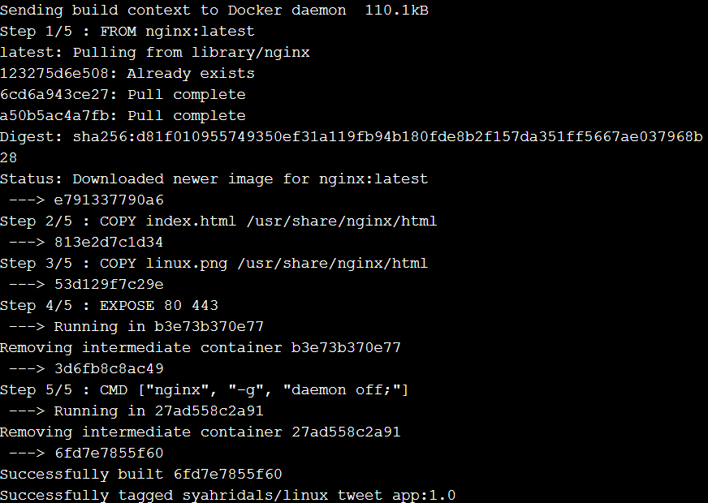

4. menjalankan container untuk menghosting image yang sebelumnya telah dibuat

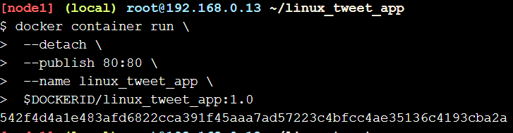

5. mengecek hasilnya dari link yang disediakan

 
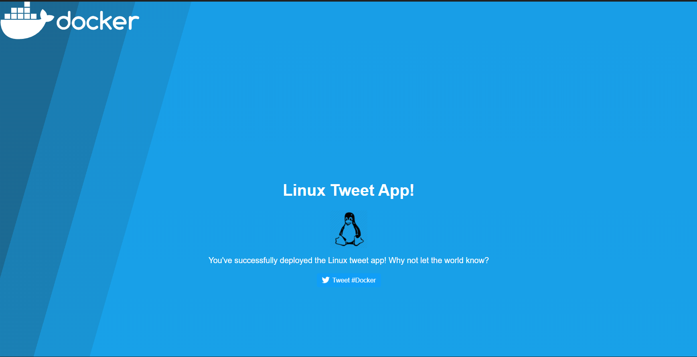

6. menghentikan dan menghapus container

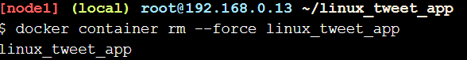

<h2>#3 modify a running website</h2>
Update the image

1. membuat image baru

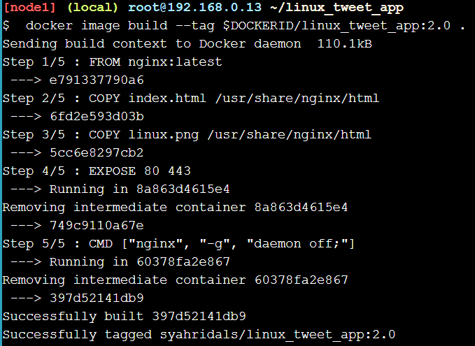

2. melihat daftar image yang ada

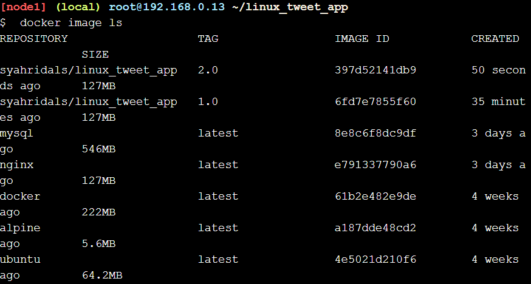

3. Login menggukan akun docker masing-masing agar dapat dipush ke akun docker kita

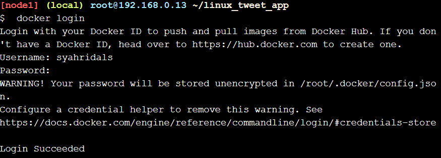

4. push image versi 1.0 dan 2.0

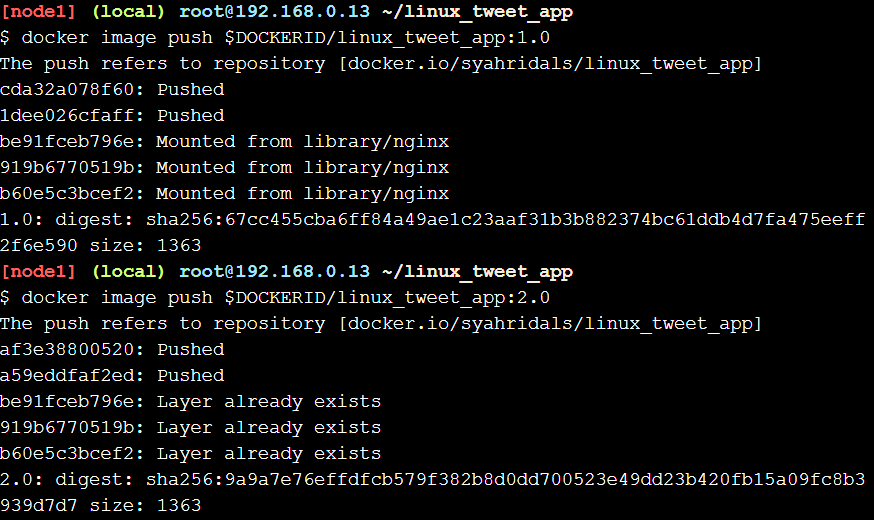

5. melihat hasil push di akun docker kita masing-masing

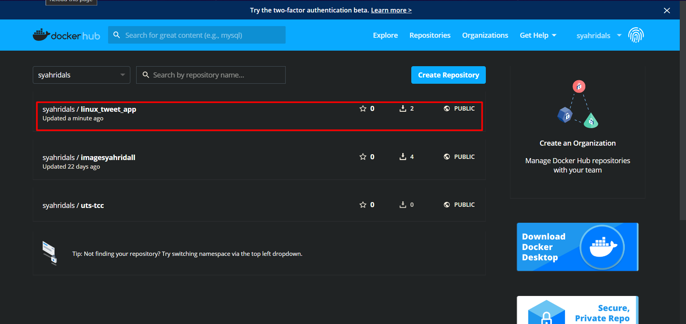