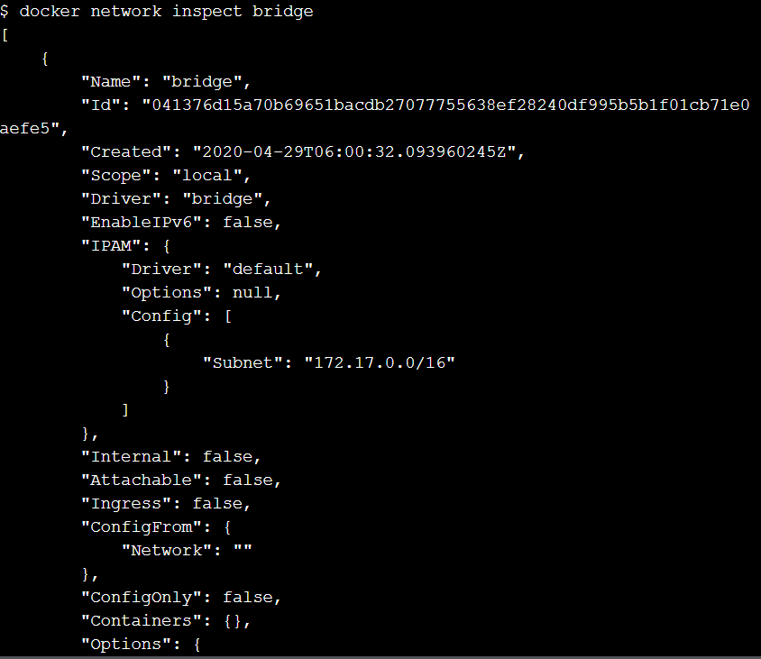
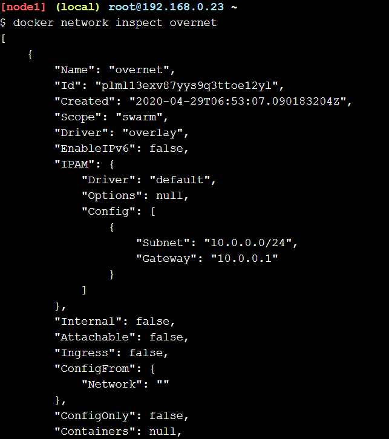

<h1>Praktikum Minggu-10(Docker Networking)</h1>

Untuk melakukan praktikum ini harus terlebih dahulu Login ke akun Docker masing-masing agar dapat menggunakan terminal yang sudah disediakan

<h2>#1-Networking Basics</h2>

1. The Docker Network Command

2. List Network

3. Inspect a Network

4. List Network driver plugins

<h2>#2-Bridge Networking</h2>

1. The basic

//Menampilkan daftar container networks
$ docker network ls

//Mengupdate dan install packages bridge-utils
$ apk update

//Menambahkan packages bridge-utils
$ apk add bridge

//Menampilkan daftar bridges pada Docker host 
$ brctl show

//Melihat detail bridge
$ ip a

2. Connect a container

//Membuat container baru
$ docker run -dt ubuntu sleep infinity

//Melihat spek container network
$ docker ps

//Menampilkan daftar bridges pada Docker host 
$ brctl show

//Menampilkan lampiran pada container bridge
$ docker network inspect bridge

3. Test Network Connectivity

//Mengetes jaringan (ping)
$ ping -c5 172.17.0.2

//Melihat spek container network
$ docker ps

//Masuk terminal ubuntu
$ docker exec -it yourcontainerid /bin/bash

//Menginstall program ping
$ apt-get update && apt-get install -y iputils-ping

//Mengetes jaringan (ping)
$ ping -c5 www.github.com

4. Configure NAT for external connectivity

//Menjalankan container baru dari official NGINX image
$ docker run --name web1 -d -p 8080:80 nginx

//Melihat spek container network
$ docker ps

//Menghubungkan ke docker host
$ curl 127.0.0.1:8080

<h2>#3-Overlay Networking</h2>

1. The basic

//Menginisialisasi docker swarm baru
$ docker swarm init --advertise-addr $(hostname -i)

//Menggabungkan node
$ docker swarm join \
>     --token SWMTKN-1-69b2x1u2wtjdmot0oqxjw1r2d27f0lbmhfxhvj83chln1l6es5-37ykdpul0vylenefe2439cqpf \
>     10.0.0.5:2377

//Melihat daftar node
$ docker node ls

2. Create an overlay network 

//Membuat sebuah overlay network
$ docker network create -d overlay overnet

//Mengecek/menampilkan network
$ docker network ls

//Melihat lebih detail informasi mengenai overnet network
$ docker network inspect overnet

3. Create a service

<h2>#4-Cleaning Up</h2>

//Menghspus layanan
$ docker service rm myservice

//Melihat spek container network
$ docker ps

//Menghapus node
$ docker swarm leave --force
