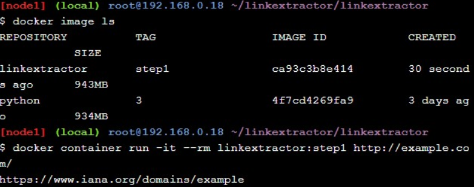
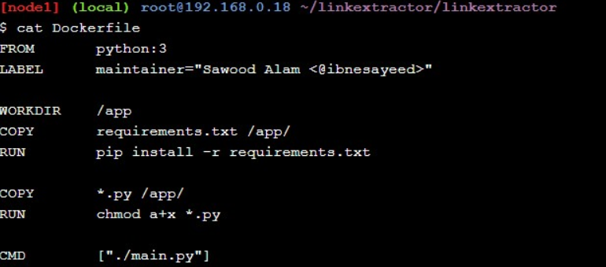

<h1>Praktikum Teknologi Cloud Computing - Minggu 11 (Application Containerization & Microservice Orchestration)</h1>

<h2>Basic Link Extractor Script</h2>

<h2>Containerized Link Extractor Script</h2>

<h2>Link Extractor Module with Full URI and Achor Text</h2>

<h2> Link Extractor API Service</h2>

<h2>Link Extractor API and Web Front End Service</h2>

<h2> Redis Service for Caching</h2>

<h2>Swap Python API Service with Ruby</h2>

