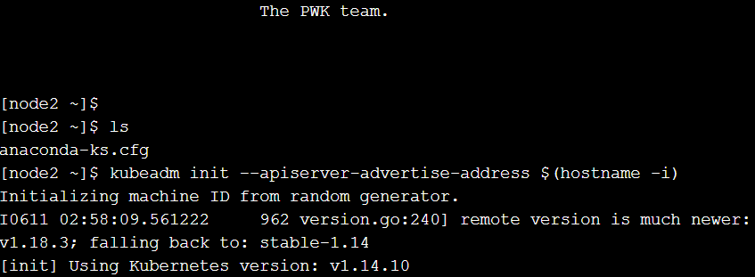

<h1>Praktikum TCC Minggu-14 (Kurbenetes For Beginners)</h1>

1. Menjalankan Perintah ls

2. Inisialisasi cluster

3. Menjalankan perintah kubectl apply -n kube-system -f
"https://cloud.weave.works/k8s/net?k8s-version=$(kubectl version | base64 |tr -d '\n')".

4. Mengcloning dockercoins

5. Masuk pada dockercoins lalu menjalankan perintah docker-compose up

6. Melihat Cluster

7. ping pada server image alpine

8. Melihat hasil deploy pada port server redis 6379

9. Melihat logs deploy worker

10. Melakukan export rng menjadi yml

11. Melakukan running

